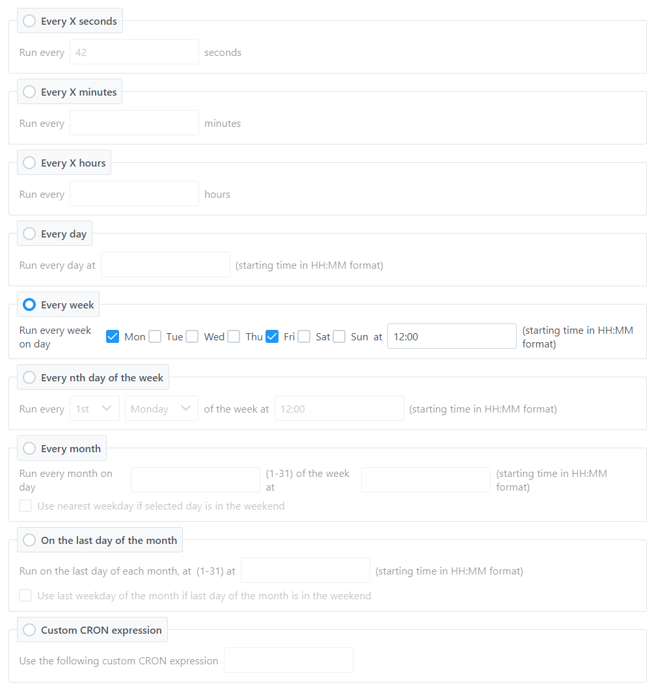

# NgxCrontabBuilder

**NgxCrontabBuilder** is an Angular/PrimeNG control that allows users to visually edit a CRONTAB string in the Qaurtz format.



This project is an Angular port of my original [CrontabBuilder for WPF](https://github.com/tarockx/CrontabBuilder).

## Live demo
A live demo is available [here](https://tarockx.github.io/ngx-crontab-builder/)

## Changelog
### v15.0.2
- Republished because of npm package problems

### Older changes
- See [changelog](./CHANGELOG.md)

## Prerequisites
This component was developed using [PrimeNG](https://github.com/primefaces/primeng). Your project needs to include the `primeng`, `primeicons` and `primeflex` packages for the component to work properly.

The library has been tested with `Angular 14.x.x` / `PrimeNG 14.x.x` which are listed as peer dependencies. It might work with older versions of Angular/PrimeNG, but this has not been tested.

## Installation
The package is available on the NPM registry. Install it with:
>npm install ngx-crontab-builder

## Usage
To use the control, first import the `NgxCrontabBuilderModule` module in your Angular app:

`import { ComponentStyle } from "ngx-crontab-builder";`

The control supports both ngModel data binding and reactive forms. Depending on which one you're using, use the following instructions:

### ngModel data binding
Like a normal input element, you can bind a `string` property to the component via `ngModel` syntax:

```HTML
<ngx-crontab-builder [(ngModel)]="currentCrontab"></ngx-crontab-builder>
```

When the user updates the configuration the new CRONTAB string will be assigned to the bound variable. Vice-versa, you can also assign a CRONTAB string to the bound property and the component will parse it and update accordingly, selecting the active mode and parameters. Note that this is only guaranteed to work with CRONTAB strings generated by the component, any unrecognized string will set the component in "custom" mode.

You can also use `ngModelChange` to be notified when the CRONTAB string changes:
```HTML
(ngModelChange)="crontabUpdated($event)"
```
the `$event` will be a string containing the new CRONTAB value.

### Reactive forms
If you're using reactive forms, simply specify the form control to use:
```HTML
<ngx-crontab-builder [formControl]="crontabControl"
```
You can use the usual reactive form control facilities (`valueChanges` and `setValue`) to listen for changes and manually change the value in code respectively.

## Further configuration
The `ngx-crontab-builder` component exposes the following properties that can be used for further customization:
* `locale` - sets the component language, must be a ISO 639-1 2-digits language code. If not set "en" (english) is the default
* `componentStyle` - the visual style of the component, can be one of the following values of the `ComponentStyle` enum:
  * `FIELDSETS` (default) - component styled as a panel with a series of field sets, one for each section
  * `PLAIN` - component styled as a plain panel with a series of dividers separating each section
  * `TABBED` - component styled as a tabbed view, with one tab for each section
* `showSecondsMode` - shows or hides the "every X seconds" section
* `showMinutesMode` - shows or hides the "every X minutes" section
* `showHoursMode` - shows or hides the "every X hours" section
* `showDayMode` - shows or hides the "every day" section
* `showWeekMode` - shows or hides the "every week" section
* `showNthDayOfWeekMode` - shows or hides the "every nth week day" section
* `showMonthMode` - shows or hides the "every month" section
* `showLastDayOfMonthMode` - shows or hides the "last day of the month" section
* `showCustomExpressionMode` - shows or hides the "custom Cron expression" section

## Building
Library can be built via angular CLI:
>ng build ngx-crontab-builder

## Demo project
A demo web app that showcases the control is provided in the `projects/crontab-builder-demo` folder.
To launch it, first build the library, then issue the following command:
>ng serve crontab-builder-demo

## Localization
Localization contributions are welcome! At the moment the available languages are:  
- `english` (by: me)
- `italian` (by: me)

If you want to contribute an additional translation:
1. Make a copy of `projects/ngx-crontab-builder/src/lang/en.ts` and put it in the same folder, naming it `XX.ts`, where `XX` is the ISO 639-1 2-digits code of the language you want to contribute.
2. Translate all the strings in the file
3. Update `projects/ngx-crontab-builder/src/lib/services/translate.service.ts` to include the new language:
   1. Import the `XX.ts` file
   2. Add the language object to the `locales` array at the start of the class
4. If every thing works correctly, make a pull request with these changes and I'll merge it! 
